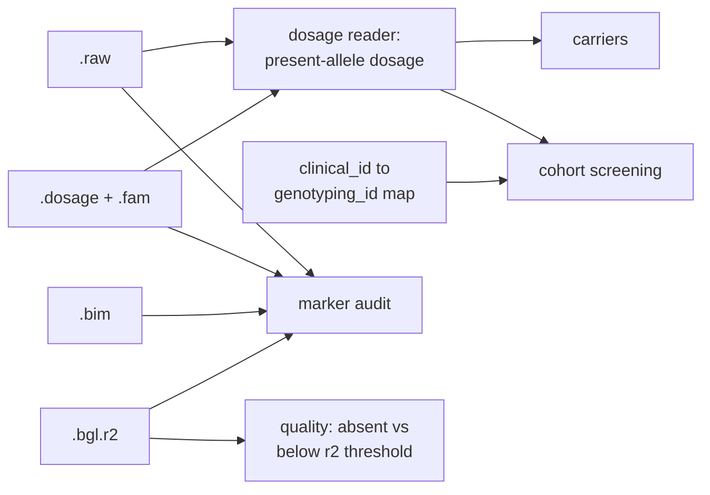

# HLA Variant Investigator

[](https://github.com/dsugurtuna/hla-variant-investigator/actions/workflows/ci.yml)

Answer the questions that come after HLA imputation: who carries this allele, is the marker present in every sub-batch, and how well was it imputed?

> **Portfolio disclaimer:** This repository contains sanitised, generalised versions of tooling developed at NIHR BioResource. No real participant data or internal paths are included.

## The problem

Imputed HLA data for a large cohort is split across many sub-batches. A request such as "find everyone in this clinical cohort carrying HLA-DRB1\*04:01" touches every sub-batch, two ID schemes and the question of whether the allele was imputed well enough to trust. Doing it with ad hoc `awk` is quick once and error-prone every time.

## What this does

- **Carrier look-up.** Finds carriers of one allele across sub-batches, counting each sample once, from PLINK `--recode A` (`.raw`) files or SNP2HLA `.dosage` files.
- **Marker audit.** Checks that the expected HLA markers appear in every sub-batch, reading `.raw` headers, `.bim` files, `.dosage` or `.bgl.r2` files.
- **Quality check.** Compares expected markers with Beagle r2 values and separates markers that were never imputed from markers imputed below a threshold. Across sub-batches a marker is judged by its lowest r2.
- **Cohort screening.** Maps clinical IDs to genotyping IDs, screens for carriers and reports back in clinical IDs, listing who could not be mapped or had no genotype data.

HLA allele markers in SNP2HLA output are coded as present (`P`) or absent (`A`). PLINK counts its A1 allele and SNP2HLA's `.dosage` counts allele 1 of each row, so every reader converts to the dosage of the *present* allele before applying a threshold.

## Quickstart

Uses the synthetic files in [`examples/`](examples/README.md).

```bash
git clone https://github.com/dsugurtuna/hla-variant-investigator.git
cd hla-variant-investigator
python3.11 -m venv .venv && source .venv/bin/activate
pip install -e ".[dev]"
pytest

python -m hla_investigator carriers examples/sub_batch_00*_imputed.dosage \
  --allele HLA_DRB1_0401 --threshold 0.5
python -m hla_investigator audit examples/*.dosage --markers HLA_DRB1_0401 HLA_DRB1_1501
python -m hla_investigator quality examples/*.bgl.r2 \
  --markers HLA_DRB1_0401 HLA_DRB1_1501 --min-r2 0.8
python -m hla_investigator screen --map examples/id_map.csv --cohort examples/cohort.txt \
  --dosage examples/sub_batch_001_imputed.dosage --allele HLA_DRB1_0401 --threshold 0.5
```

`audit` and `quality` exit with 1 when they find a problem; on the examples they report `HLA_DRB1_1501` missing from the second sub-batch and `HLA_DRB1_0401` below the r2 threshold there (0.41).

From Python:

```python
from hla_investigator import CarrierIdentifier

result = CarrierIdentifier(threshold=0.5).identify_across_batches(
    ["examples/sub_batch_001_imputed.dosage", "examples/sub_batch_002_imputed.dosage"],
    "HLA_DRB1_0401",
    fam_paths=[
        "examples/sub_batch_001_imputed.fam",
        "examples/sub_batch_002_imputed.fam",
    ],
)
print(result.total_carriers, result.per_batch_counts)
```

## How it works



| Module | Role |
| :--- | :--- |
| `dosage.py` | Readers for `.raw`, `.dosage` + `.fam`, `.bgl.r2`, and marker lists |
| `carrier.py` | Carriers across sub-batches |
| `auditor.py` | Expected markers per file |
| `quality.py` | r2 check |
| `screener.py` | Clinical cohort screening |
| `__main__.py` | `carriers`, `audit`, `quality`, `screen` commands |

## Design decisions

- **One reader, explicit allele orientation.** Every command goes through the same dosage reader, which checks which allele was counted. A carrier list built on the absent allele would be exactly wrong, silently.
- **Lowest r2 wins across sub-batches.** Averaging would let one badly imputed sub-batch hide behind good ones; the people in that sub-batch are the ones affected.
- **Absent and poorly imputed are different findings.** An allele missing from the reference panel needs a different panel; an allele with low r2 needs caution or a different threshold.
- **Screening reports in clinical IDs.** Genotyping IDs are used internally and never printed, and unmapped or ungenotyped people are listed rather than silently counted as non-carriers.
- **Standard library only**, so it runs in restricted analysis environments.

## Limitations and what it is not

- A carrier threshold on imputed dosage is a screening choice, not a clinical genotype. The default of 0 (any non-zero dosage) matches the original scripts; 0.5 is often more sensible.
- The default audit panel is a fixed list of four-digit HLA-DRB1 alleles; pass `--markers` for anything else.
- It reads SNP2HLA and PLINK layouts only.
- The ID map is trusted as given; duplicate or conflicting mappings are not detected.
- The scripts in `legacy/` are kept as originally published for reference. They are not maintained, not linted, and create placeholder files when inputs are missing.

## Where this fits

Works on output from [hla-pipeline-manager](https://github.com/dsugurtuna/hla-pipeline-manager); run-level failures are diagnosed with [hla-imputation-analyst](https://github.com/dsugurtuna/hla-imputation-analyst). Carrier lists feed recall work such as [recall-study-generator](https://github.com/dsugurtuna/recall-study-generator).

## Roadmap

- Detect duplicate or conflicting IDs in the mapping file.
- Look up several alleles in one pass (for example a shared-epitope set).
- Report per-sample dosage alongside each carrier so borderline calls are visible.

## Licence

MIT is declared in `pyproject.toml`, but no licence file is included yet.

---

Personal project by [Ugur Tuna](https://github.com/dsugurtuna). Not affiliated with or endorsed by any employer.
